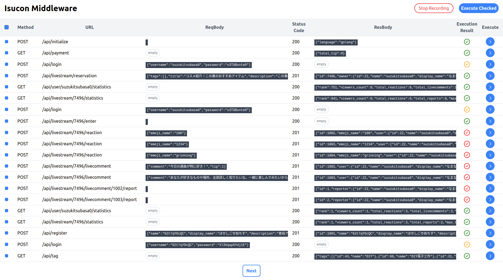
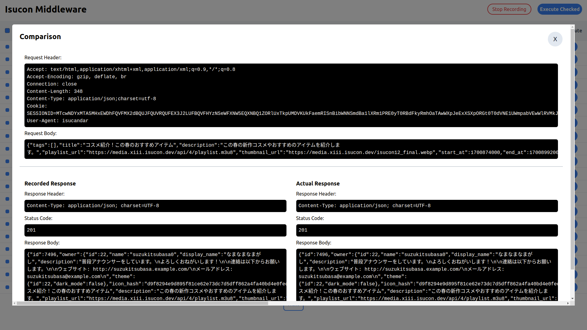

# Isucon Middleware

Make it easy to debug Isucon!




## Features

- Recording of requests and responses that reach the application.
- Execution of any recorded request from the Web UI, and comparison of its result with the recorded response.

## How to install

```
go get github.com/kajikentaro/isucon-middleware/isumid
```

Here are several examples to install Isucon Middleware to your applications depends on each web framework.

NOTE:
We can't use the wrapper which can be used in web framework such as `e.Use(echo.WrapMiddleware(...))`.

### Echo

```go
  e := echo.New()
  e.GET("/api/xxxx", userHandlerXXX)

  rec := isumid.New(nil) /* ADD */
  err := http.ListenAndServe(":8080", rec.Middleware(e)) /* ADD */
  // e.Start(":8080") /* REMOVE */
  log.Fatal(err, "failed to start server")
```

### chi

```go
  r := chi.NewRouter()
  r.GET("/api/xxxx", userHandlerXXX)

  rec := isumid.New(nil) /* ADD */
  http.ListenAndServe(":8080", rec.Middleware(r)) /* ADD */
  // e.Start(":8080") /* REMOVE */
  log.Fatal(err, "failed to start server")
```

## Settings

The behavior of Isucon Middleware can be customized by passing configuration settings as arguments.

```go
	rec := isumid.New(&isumid.Setting{
		Prefix:        "/isumid",
		OutputDir:     "/tmp/isumid",
		RecordOnStart: true,
		AutoStart: &isumid.AutoSwitch{
			TriggerEndpoint: "/initialize",
			AfterSec:        1,
		},
		AutoStop: &isumid.AutoSwitch{
			TriggerEndpoint: "/initialize",
			AfterSec:        75,
		},
	})
```

- Prefix  
  URL prefix to serve the Web UI and APIs. e.g. `"/foo"` serves the Web UI at `/foo/`. Defaults to `/isumid`.
- AutoStart  
  If `TriggerEndpoint` is accessed, Isucon Middleware starts recording after `AfterSec` seconds have elapsed.
- AutoStop  
  If `TriggerEndpoint` is accessed, Isucon Middleware stops recording after `AfterSec` seconds have elapsed.

## How to use

After installation, let's access `/isumid/` (or `/<Prefix>/` if you set `Prefix`).

Please note that settings of Nginx or other middlewares are configured correctly to accesss the URL start from `/isumid/` (or `/<Prefix>/`) prefix.

## Analyze recorded data with SQL

Recorded data is stored under `OutputDir` (default: `/tmp/isumid`).

- `isumid.sqlite`: metadata of each request (table `metadata`, one row per request)
- `body/<ulid>.req.body`, `body/<ulid>.res.body`: request / response bodies

Rows are inserted in the background up to 1 second after the response. To take a consistent copy, use `sqlite3 /tmp/isumid/isumid.sqlite ".backup dump.sqlite"` (the database is in WAL mode, so copying only `isumid.sqlite` may miss recent rows).

### Columns of `metadata`

| Column | Type | Description |
| --- | --- | --- |
| `ulid` | TEXT | ID of the request. The time part is when the record was saved (after the handler returned). Primary key. |
| `method` | TEXT | e.g. `GET` |
| `url` | TEXT | Path with the query string, e.g. `/message?channel_id=1` |
| `path` | TEXT | Path without the query string, e.g. `/message` |
| `statusCode` | INTEGER | Response status code |
| `startedAtUs` | INTEGER | When the request entered Isucon Middleware, in Unix microseconds |
| `durationUs` | INTEGER | Time spent in the application handler (`next.ServeHTTP`), in microseconds |
| `reqHeader` | TEXT | Request headers as JSON, e.g. `{"Accept-Encoding":["gzip"],"Cookie":["session=..."]}` |
| `resHeader` | TEXT | Response headers set by the application as JSON. Headers added by `net/http` itself (`Date`, `Content-Length`, a sniffed `Content-Type`) are not included. |
| `reqLength`, `resLength` | INTEGER | Size of the request / response body in bytes |
| `isReqText`, `isResText` | BOOLEAN | Whether the body is shown as text in the Web UI |

Notes:

- `startedAtUs` is taken after `net/http` has read the request header, and `durationUs` ends when the handler returns (part of the response may still be in the write buffer). The response was completed at about `startedAtUs + durationUs`.
- Headers can be read with the JSON functions, e.g. `json_extract(reqHeader, '$.Cookie[0]')` (or `reqHeader ->> '$.Cookie[0]'` on SQLite 3.38+). It is NULL if the header is absent.
- Data recorded by older versions of Isucon Middleware (headers as msgpack BLOBs) is not supported. Remove `OutputDir` before using this version.

### Examples

Count and handler time (p50 / p90) per endpoint:

```sql
WITH t AS (
  SELECT method, path, durationUs,
         ROW_NUMBER() OVER (PARTITION BY method, path ORDER BY durationUs) AS rn,
         COUNT(*)     OVER (PARTITION BY method, path) AS n
  FROM metadata
)
SELECT method, path, n AS count,
       MIN(CASE WHEN rn >= n * 0.5 THEN durationUs END) AS p50_us,
       MIN(CASE WHEN rn >= n * 0.9 THEN durationUs END) AS p90_us,
       MAX(durationUs) AS max_us,
       SUM(durationUs) / 1000 AS total_ms
FROM t
GROUP BY method, path
ORDER BY total_ms DESC;
```

If paths contain IDs (e.g. `/channel/1`), group them with `CASE WHEN path LIKE '/channel/%' THEN '/channel/:id' ELSE path END` instead of `path`.

Count per `Set-Cookie` (the `name=value` part):

```sql
SELECT substr(value, 1, instr(value || ';', ';') - 1) AS cookie_pair, COUNT(*) AS count
FROM metadata, json_each(resHeader, '$.Set-Cookie')
GROUP BY cookie_pair
ORDER BY count DESC;
```

Requests per second per endpoint:

```sql
SELECT (startedAtUs - (SELECT MIN(startedAtUs) FROM metadata)) / 1000000 AS sec,
       path, COUNT(*) AS count
FROM metadata
GROUP BY sec, path
ORDER BY sec, path;
```

Requests per user (`Cookie`):

```sql
SELECT json_extract(reqHeader, '$.Cookie[0]') AS cookie, COUNT(*) AS count,
       (MAX(startedAtUs) - MIN(startedAtUs)) / 1000 AS span_ms
FROM metadata
WHERE cookie IS NOT NULL
GROUP BY cookie
ORDER BY count DESC;
```

Bodies can be read with `readfile()` of the `sqlite3` command when it is run in `OutputDir`. e.g. the number of items returned by `GET /message` (a JSON array, not compressed):

```sql
SELECT ulid, json_array_length(CAST(readfile('body/' || ulid || '.res.body') AS TEXT)) AS items
FROM metadata
WHERE method = 'GET' AND path = '/message';
```

## Develop Isucon Middleware

### Directory structure

- `/frontend`  
  Web UI built with Vite + React. Please run `make build-front` after updating this directory to copy build file to `/isumid`
- `/isumid`  
  Isucon Middleware built with Go.
