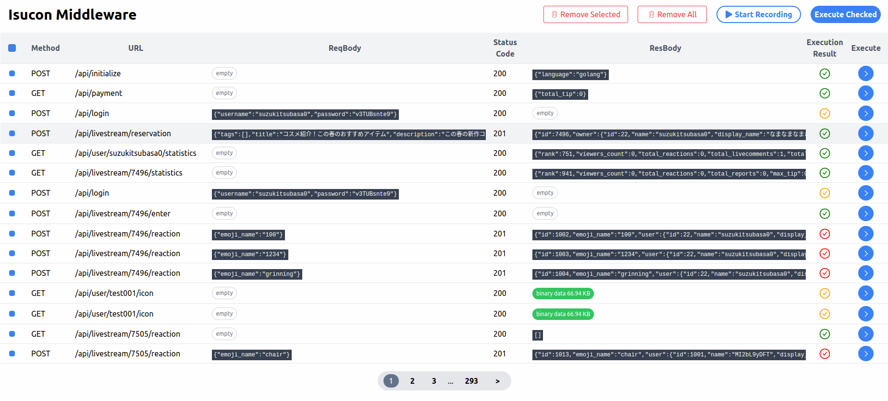

# Isucon Middleware

Make it easy to debug Isucon!




## Features

- Recording of requests and responses that reach the application.
- Execution of any recorded request from the Web UI, and comparison of its result with the recorded response.

## How to install

```
go get github.com/kajikentaro/isucon-middleware/isumid
```

Here are several examples to install Isucon Middleware to your applications depends on each web framework.

NOTE:
We can't use the wrapper which can be used in web framework such as `e.Use(echo.WrapMiddleware(...))`.

### Echo

```go
  e := echo.New()
  e.GET("/api/xxxx", userHandlerXXX)

  rec := isumid.New(nil) /* ADD */
  err := http.ListenAndServe(":8080", rec.Middleware(e)) /* ADD */
  // e.Start(":8080") /* REMOVE */
  log.Fatal(err, "failed to start server")
```

### chi

```go
  r := chi.NewRouter()
  r.GET("/api/xxxx", userHandlerXXX)

  rec := isumid.New(nil) /* ADD */
  http.ListenAndServe(":8080", rec.Middleware(r)) /* ADD */
  // e.Start(":8080") /* REMOVE */
  log.Fatal(err, "failed to start server")
```

## Settings

The behavior of Isucon Middleware can be customized by passing configuration settings as arguments.

```go
	rec := isumid.New(&isumid.Setting{
		OutputDir:     "/tmp/isumid",
		RecordOnStart: true,
		AutoStart: &isumid.AutoSwitch{
			TriggerEndpoint: "/initialize",
			AfterSec:        1,
		},
		AutoStop: &isumid.AutoSwitch{
			TriggerEndpoint: "/initialize",
			AfterSec:        75,
		},
	})
```

- AutoStart  
  If `TriggerEndpoint` is accessed, Isucon Middleware starts recording after `AfterSec` seconds have elapsed.
- AutoStop  
  If `TriggerEndpoint` is accessed, Isucon Middleware stops recording after `AfterSec` seconds have elapsed.

## How to use

After installation, let's access `/isumid/index.html`.

Please note that settings of Nginx or other middlewares are configured correctly to accesss the URL start from `/isumid/` prefix.

## Develop Isucon Middleware

### Directory structure

- `/frontend`  
  Web UI built with Next.js. Please run `make build-front` after updating this directory to copy build file to `/isumid`
- `/isumid`  
  Isucon Middleware built with Go.
